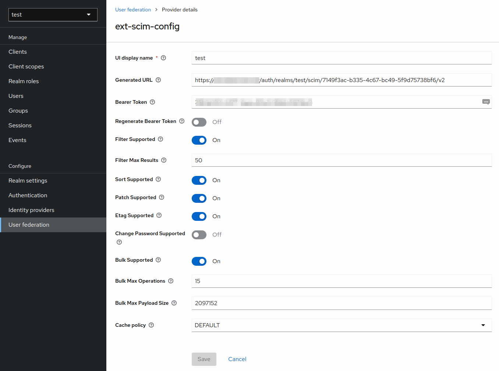

> :warning: This is an experimental fork of the [scim-for-keycloak](https://github.com/Captain-P-Goldfish/scim-for-keycloak) project to asses the viability of exposing a simple SCIM server that is configured (hacked) using automatic admin UI of a User Federation provider. It is only posted here for collaborators. If you need a mature SCIM implementation, buy it from Pascal at (https://scim-for-keycloak.de/).

TODO
- Create a Filter class that can be passed to the endpoint that restricts the users/groups that can be modified (e.g. email domain filter based on org). Save this in the config.
- Filtering on database level (this seems to be the problem with the previous oss version). 
- Clean up and document better.
- Add more configuration to the ConfigurationProperties that can be added to the service provider config - DONE

# keycloak-scim

A full SCIM implementation that is easily integrated into Keycloak. It grants you interoperable User, Group and Role provisioning by using a defined standard for resource managing:

See:

* https://tools.ietf.org/html/rfc7643
* https://tools.ietf.org/html/rfc7644

## Configuration

In the Keycloak Admin UI, navigate to the *User Federation* section and add new provider of type *SCIM v2*

Don't fill out the *Generated URL* or *Generated Bearer Token* fields. These will be generated for you after saving. If you need to regenerate the Bearer Token, switch *Regenerate Bearer Token* and save.

